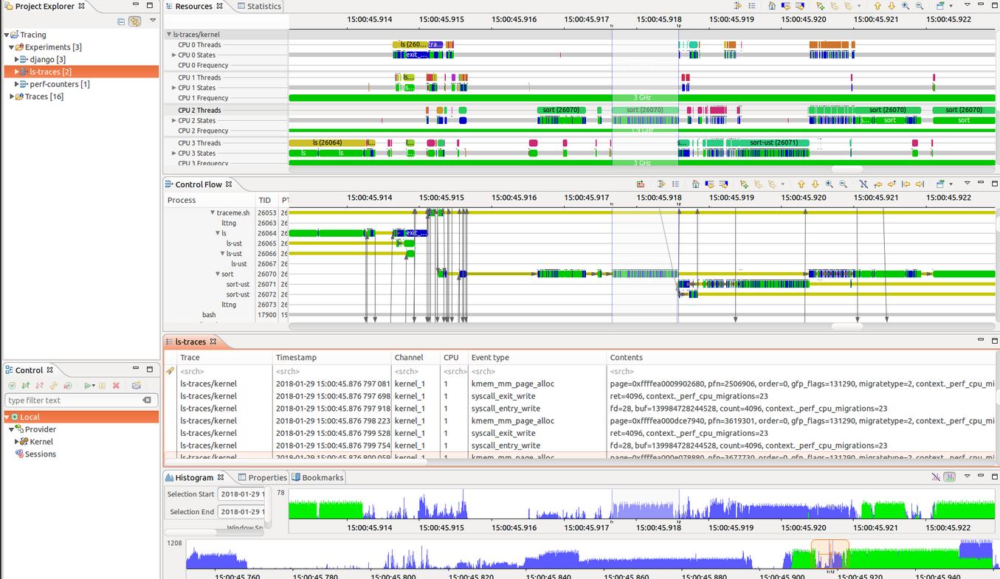

# Eclipse Trace Compass

`Eclipse Trace Compass™` is an open source application to solve performance and
reliability issues by reading and analyzing logs or traces of a system. Its goal
is to provide views, graphs, metrics, and more to help extract useful
information from traces, in a way that is more user-friendly and informative
than huge text dumps.

`Eclipse Trace Compass` is also a framework to build such trace analysis and
visualization tools. It provides Eclipse extension points, declarative XML and
scripting capabilities to extend the core Trace Compass functionality for 
domain-specific trace formats and use cases.

For more information about the key features, see [Trace Compass website](https://eclipse.dev/tracecompass/).

Also, check-out the [user guides and developer guides](https://github.com/eclipse-tracecompass/org.eclipse.tracecompass/wiki#user-guides).

## Releases

Information about releases can be found on the [Trace Compass project](https://projects.eclipse.org/projects/tools.tracecompass) page at Eclipse.org.

See [New & Noteworthy](https://github.com/eclipse-tracecompass/org.eclipse.tracecompass/wiki/New_In_Trace_Compass)
for release details.

## Downloads

`Eclipse Trace Compass` is available as plug-ins that can be installed to an
Eclipse IDE, as well as standalone application.

Check [Downloads](https://projects.eclipse.org/projects/tools.tracecompass/downloads) for downloading specific versions of Trace Compass.

## Building and Tracing Trace Compass

Information about building and tracing Trace Compass can be found in the [building guide](BUILDING.md).

## Contributing to Trace Compass

**👋 Want to help?** Read our [contributor guide](CONTRIBUTING.md) and follow the
instructions to contribute code.

You will also find there information about the `setup of the development environment`,
`build instructions`, the `development and review process` as well as the `API policy`.

## Reporting issues

Read our [contributor guide](CONTRIBUTING.md#when-to-submit-patches) to get details on
how to report issues.

## Help and support

See [contact](CONTRIBUTING.md#contact) section of the contributor guide on how to get help and support. 
